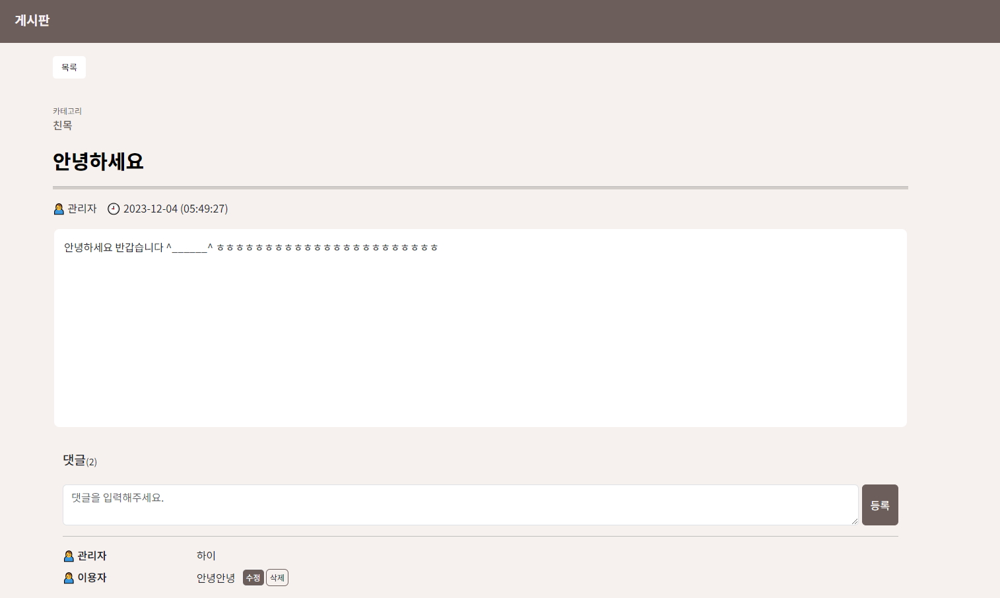

# 웹 프로젝트 '텐조린' 개발일지 (박병조, 박규리)
- Django, Vue 를 활용한 금융상품추천 사이트
- 금융상품통합공시API, 카카오맵API, 한국수출입은행API 까지 3가지 오픈API를 활용하여 사용자 편의성에 중점을 둔 프로젝트

## 개발기간
- 2023.11.16 ~ 2023.11.24

## 주요 기능
- 메인 화면
    - 상단의 네비게이션바와 캐러셀을 활용하여 주요 기능을 직관적으로 안내

- 회원 관리
    - 회원가입, 가입한 사용자를 대상으로 로그인, 로그아웃, 게시글 작성, 댓글 작성, 상품 가입 등이 가능
    - 비밀번호 변경, 개인정보 수정 기능 포함
    - 사용자가 가입한 금융 상품 정보를 차트를 활용하여 안내

- 상품 조회
    - 예금상품과 적금상품을 데이터셋을 분리하여 보여주며 간단한 조작으로 정렬 기준을 변경가능
    - 상품 클릭시 상품의 상세정보를 확인 가능
    - 상품 상세화면에서 옵션클릭시 상품+옵션 가입 가능

- 커뮤니티
    - 사용자간의 정보전달 및 교류 목적의 게시판이 제공
    - 댓글 기능 포함
    - 작성자 본인만 삭제 및 수정 가능(관리자 제외)
    - 카테고리별 관리 가능
    
    
    
    
    

- 기타 기능
    - 환율 검색
    
    
    - 은행 검색
    

## 상품추천 알고리즘에 대한 설명
- 저희 텐조린의 알고리즘은 상품을 추천받을 사용자를 기준으로 모든 상품에 대한 평가를 진행하여 고평가받은 상품들을 순차적으로 보여줍니다.
    1. 대상의 나이를 고려하여 전체사용자 데이터에서 우선적으로 추출합니다.
    2. 모든 상품에 대해 1. 에서 추출한 사용자 데이터들의 가입여부와 각 조건별 비교에 따라 차등 점수를 부과하여 합산합니다.
    3. 2. 의 결과를 정렬하여 고득점한 상품들을 보여줍니다.
이 알고리즘은 나이, 투자성향, 결혼유무, 자산, 연봉 5가지에 대해 고려하여 추천해주는 기능입니다.

## 작업
### ERD

### 업무 분담
- 박규리
    - 커뮤니티
        - 사용자 간의 다양한 글을 게시할 수 있는 게시판 구현 및 관련 화면 작업
        - 댓글기능, 카테고리 선택기능 등 고려
    - API 호출 및 처리
        - 카카오맵 API 이용 주변은행 검색 구현 및 관련 화면 작업
        - 환율 계산을 위한 오픈 API를 이용 환율계산기 구현 및 관련 화면 작업
- 박병조
    - 회원 기능
        - 로그인, 로그아웃, 회원가입, 정보수정 등 기능 처리
        - 사용자의 가입상품에 대한 처리
        - 가입한 상품에 대한 금리 비교를 차트 이용하여 구현
    - 상품 관련 기능
        - 금융상품통합공시 API 에서 상품데이터 추출 및 처리
        - 클라이언트에게 전달할 데이터를 목적에 맞게 정리
    - 상품 추천 알고리즘
        - 다양한 사용자 더미데이터를 활용하여 추천 상품 목록 반환하기
---
### 1일차(11월 16일)
- 프로젝트 구현 목표 설정 및 기본 front-part와 back-part 환경 구성
    - 라이브러리 환경 설정
- DB에 대한 회의
    - 모델에 대한 정리가 부족했고, ERD에 대한 논의도 필요
- User 모델생성 및 회원가입 기능 구현
    - Allauth 를 이용한 빠른 구현이 가능했음.
- 환율계산기 구현 시작
    - 국가 선택기능, 통화단위 처리, 국가변경시 금액 변경 기능
### 2일차(11월 17일)
- 환율 계산기 기능(90%)
    - 디자인 제외 기능 구현 완료
- 지도 기능 구현시작
    - 초기화면 설정: 서울시청
    - 목적에 맞는 input창 및 옵션 선택 창 생성
    - 세부사항 수정예정
- 회원 관리 기능 (50%)
    - 회원 정보 수정 기능 기초단계 구현..(수정만 됨)
    - 로그인 기능 구현
    - 로그인시 token을 local storeage에 저장하여 로그인을 유지
- 금융 상품 조회 기능 구현 시작
    - 관리자가 아닌 이상 front단에서 필요하지 않은 기능이라 판단
    - 관리자가 요청을 누를시 front단에서 금감원 API에 다이렉트로 요청을 날리는 것이 아닌  front->back->금감원API 방식으로 진행
### 3일차(11월 18일)
- 지도 기능(60%)
    - 옵션 선택시 지도 화면에 검색결과가 나오는 것을 확인
    - 은행목록 구현, 확대사이즈 설정 등 세부사항 수정 필요
- 회원 관리 기능(65%)
    - 로그아웃 기능 구현
- 금융 상품 조회 기능 (40%)
    - 클라이언트단 까지 데이터를 가지고는 왔음
    - 해당 데이터를 적절한 처리 혹은 적절한 라이브러리를 찾지 못해 추가 조사필요..
### 4일차(11월 19일)
- 지도 기능(70%)
    - 은행 검색시 목록띄우는 기능 추가
- 게시판 기능 구현 시작
    - Model 및 기본 url작업
- 회원 관리 기능(80%)
    - 사용자 정보 수정 및 수정된 데이터 사용자 프로필화면에서 확인가능
- 금융 상품 조회 기능 (70%)
    - 테이블 관련 라이브러리 결정(vue-good-table-next)
    - 상품의 옵션의 종류가 다양하고, 이것을 구분하기는 상품테이블에선 불가능하다고 판단
    - 상품과 옵션을 모두 가져온 후, 데이터 테이블 행을 직접 만드는 방식 채택
### 5일차(11월 20일)
- 지도 기능(85%)
    - 검색 결과 이상 수정
- 게시판 기능(50%)
    - 게시글 CRUD
    - 댓글 CR
- 금융 상품 조회 기능(80%)
    - DB 테이블 정리
    - 호출시 필요한 데이터를 정확하게 반환하도록 처리
    - 예금, 적금 테이블 컴포넌트 분리
    - 상품 클릭시 상세화면 이동
### 6일차(11월 21일)
- 지도 기능(90%)
    - 목록 보여주기, 목록 클릭시 지도 이동 기능 구현
- 게시판 기능(70%)
    - 작성자만 게시글/댓글 수정 삭제 할 수 있도록 수정
    - 카테고리선택기능 추가 (관리자 전용)
- 금융 상품 조회 기능(85%)
    - 상품 상세 화면에서 상품 상세정보 및 상품 옵션이 보이도록 처리
- 회원 관리 기능(90%)
    - 사용자 프로필화면에서 가입한 상품 데이터를 보여주도록 처리(chart.js활용)
    - 상품 추천 알고리즘 구상 시작
### 7일차(11월 22일)
- 지도 기능(95%)
    - 상세 창에 대한 처리
- 게시판 기능(90%)
    - 카테고리 관리는 관리자만 가능하도록 처리
    - 일반사용자는 카테고리 선택만 가능하도록 처리
    - 카테고리 선택시 해당 카테고리 게시글만 보도록 처리
- 금융 상품 조회 기능(90%)
    - 상품 상세정보화면에서 옵션클릭시 가입되도록 처리
    - 중복 상품은 가입되지 않도록 처리
- 회원 관리 기능(95%)
    - 알고리즘 논리 확립 후 기능에 적용 및 확인
### 8일차(11월 23일)
- 지도 기능(100%)
    - CSS 작업
- 환율 계산 기능(100%)
    - CSS 작업
- 게시판 기능(100%)
    - CSS 작업
- 금융 상품 조회 기능(100%)
    - CSS 작업
- 회원 관리 기능(100%)
    - CSS 작업
    